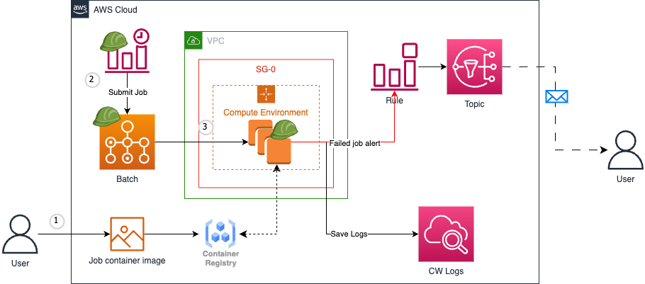
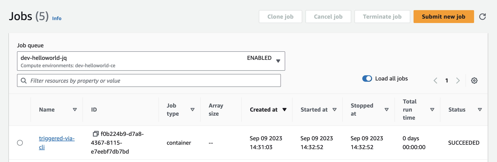

# Setup an on-demand Job Infrastructure using AWS Batch
This repo is used to setup an AWS Batch job infrastructure using Terraform quickly. In the infrastructure, several AWS services are involved, such as AWS Batch, IAM, CloudWatch Event (EventBridge), Secret Manager, etc. It foucses on how to define and organize these AWS resources using Terraform to make them work together.
So, if you have knowledge and experience on Terraform and AWS Batch service, and are looking for a quick setup to build an on-demand application using AWS Batch service, this sample repo should provide some information and ideas. 

So, what is AWS Batch? As a fully managed service, AWS Batch helps you to run batch computing workloads of any scale. With AWS Batch, we define provisioning resources and schedulers, package application in a container, specify job's dependencies in job definition. The workload is triggered by CloudWatch Event (EventBridge) as scheduled, and processed in AWS EC2 instance. AWS Batch dynamically provisions the optimal quantity and type of compute resources based on the volume and specified resource requirements of the batch jobs submitted.

## Project Architecture
Here is the architecutre diagram for the Batch solution.



Workflow steps:
1. User creates a docker image, uploads the image to the Amazon ECR or another container registry (for example, DockerHub), and creates a job definition, compute environment and job queue in AWS Batch. In this repo, we use an AWS official image `public.ecr.aws/amazonlinux/amazonlinux:latest` for demo purpose.
2. Batch job is submitted using job definition into the job queue in AWS Batch by CloudWatch Event regularly as scheduled.
3. AWS Batch launches an EC2 instance in computing environment, pulls the image from the image registry and create an container.
4. The container should implement some tasks on your behave.
5. After done, the container will be stopped and removed. EC2 Instance is shutdown automatically by AWS Batch. 

## Terraform Structure
All AWS infrastructure is created and maintained using Terraform. The Terraform structure contains several components shows as below.

```bash
.
├── config.tfbackend  # Remote backend config file
├── data.tf           # File for Terraform data source 
├── main.tf           # The reference of modules
├── outputs.tf        # The outputs of Terraform resources
├── terraform         
│   ├── dev           # Environment specified variables
│   └── modules       # Terraform modules
├── variables.tf      # Terraform input variables that shoudl be passed to the arch module
└── versions.tf       # Defines the versions of Terraform and provides
```

## Deploy/Destory Terraform Infrastructure
Run below commands to deploy Terraform infrastructure to AWS.

```bash
make apply
```

We also provide command to destory AWS resources.
```bash
make destroy
```

## Submit Batch Job Manually
Currently, the Batch job is submitted/triggered by CloudWatch Event (EventBridge) per day regularly as scheduled. However, you are allowed to submit a job manually via [AWS CLI](https://docs.aws.amazon.com/cli/latest/reference/batch/submit-job.html) as below. Or from AWS Console directly.

> Don't forget to update job definition revision in `--job-definition` if you have a new revision created. Only the latest revision is ACTIVE.

```bash
# Setup AWS_PROFILE with permission to submit batch job
export AWS_PROFILE=service.hyc-deploy-ci-bot

# Submit a job using CLI
aws batch submit-job \
  --job-name triggered-via-cli \
  --job-definition arn:aws-cn:batch:cn-north-1:756143471679:job-definition/dev-carbon-jd:6 \
  --job-queue arn:aws-cn:batch:cn-north-1:756143471679:job-queue/dev-carbon-jq
```
After submitted successfully, go to AWS Console -> Batch -> Jobs. Select the target job queue from the dropdown list, then your new submitted job will be listed on the top. It will spend a few minutes for a job to complete, according to the job processing time, and whether you allocate an EC2 instance resource in advance by giving variable `desired_vcpus` a number greater than 0 or not.

As designed, we keep the `desired_vcpus` as `0` as default for saving cost, which means a new EC2 instance will be launched when a new job is submitted and shut down immediately after completed. The screenshot below shows the lastest job that submmitted by CloudWatch Event (EventBridge) at 04:00 AM (UTC).



## Logging
The logging data is saved to CloudWatch Logs automatically. You can find the logs on the bottom of the job details (some delay to sync logs from CloudWatch Logs). In the job details view page, it also provides a link to the log stream of current job. AWS creates a CloudWatch Logs group named `/aws/batch/job` automatically when you submit a Batch job at the first time in the same region.