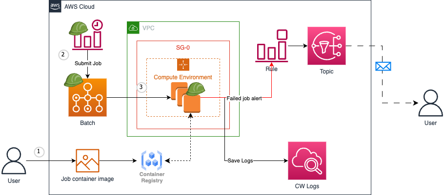
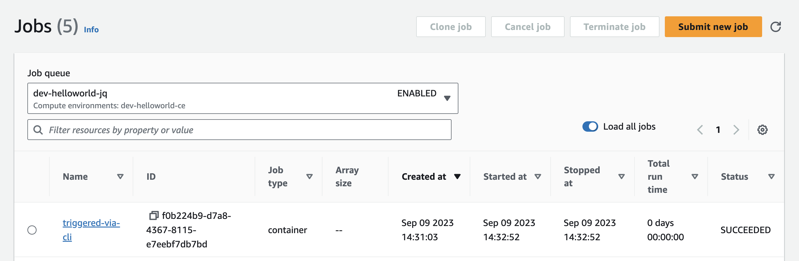

# Setup an on-demand Job Infrastructure using AWS Batch

This repo is used to setup an AWS Batch job infrastructure using Terraform quickly. In the infrastructure, several AWS services are involved, such as AWS Batch, IAM, CloudWatch Event (EventBridge), Secret Manager, etc. It foucses on how to define and organize these AWS resources using Terraform to make them work together.
So, if you have knowledge and experience on Terraform and AWS Batch service, and are looking for a quick setup to build an on-demand application using AWS Batch service, this sample repo should provide some information and ideas.

So, what is AWS Batch? As a fully managed service, AWS Batch helps you to run batch computing workloads of any scale. With AWS Batch, we define provisioning resources and schedulers, package application in a container, specify job's dependencies in job definition. The workload is triggered by CloudWatch Event (EventBridge) as scheduled, and processed in AWS EC2 instance. AWS Batch dynamically provisions the optimal quantity and type of compute resources based on the volume and specified resource requirements of the batch jobs submitted.

## 📁 Project Architecture

Here is the architecutre diagram for the Batch solution.



Workflow steps:

1. User creates a docker image, uploads the image to the Amazon ECR or another container registry (for example, DockerHub), and creates a job definition, compute environment and job queue in AWS Batch. In this repo, we use an AWS official image `public.ecr.aws/amazonlinux/amazonlinux:latest` for demo purpose.
2. Batch job is submitted using job definition into the job queue in AWS Batch by CloudWatch Event regularly as scheduled.
3. AWS Batch launches an EC2 instance in computing environment, pulls the image from the image registry and create an container.
4. The container should implement some tasks on your behave. An email notification will be triggered if the job is failed.
5. After done, the container will be stopped and removed. EC2 Instance is shutdown automatically by AWS Batch.

## 📁 Terragrunt Structure

All AWS infrastructure is created and maintained using Terragrunt. The Terragrunt structure contains several components shows as below.

```bash
.
├── environments                      # Terragrunt environments directory
│   ├── common.hcl                    # Common Terragrunt configuration file
│   ├── dev                           # Development environment Terragrunt configuration directory
│   │   ├── compute
│   │   ├── env.hcl
│   │   ├── messaging
│   │   └── security
│   ├── prod                          # Production environment Terragrunt configuration directory
│   ├── root.hcl
│   └── staging                       # Staging environment Terragrunt configuration directory
└── source                            # Terraform source code directory
    ├── modules                       # Terraform modules directory
    │   ├── eventbridge_rule
    │   ├── iam_role
    │   ├── secretsmanager
    │   └── sns_topic
    └── units                         # Terraform units directory
        ├── compute
        ├── messaging
        └── security
```

## 🚀 Deploy/Destory Terraform Infrastructure

To deploy/destory the Terraform infrastructure, please follow the steps as below.

```bash
# plan and apply Terraform infrastructure security to dev environment
just plan dev security
just apply dev security

# destroy Terraform infrastructure security - dev environment
just destroy dev security

# plan and apply all Terraform infrastructures to dev environment
just plan-all dev
just apply-all dev

# destroy all Terraform infrastructures - dev environment
just destroy-all dev
```

## 📚 Generate Documentation for Modules and Units

To generate documentation for all modules and units, please follow the steps as below.

```bash
# re-generate documentation for all modules and units
just docs

# clean up all generated documentation for all modules and units
just clean-docs
```

## ⚡ Submit Batch Job Manually

Currently, the Batch job is submitted/triggered by CloudWatch Event (EventBridge) per day regularly as scheduled. However, you are allowed to submit a job manually via [AWS CLI](https://docs.aws.amazon.com/cli/latest/reference/batch/submit-job.html) as below. Or from AWS Console directly.

### 1. `just submit-job ENVIRONMENT JOB_NAME`

Submits a batch job with the specified name.

```bash
# Submit a simple job to dev environment
just submit-job dev trigger-via-cli
```

After submitted successfully, go to AWS Console -> Batch -> Jobs. Select the target job queue from the dropdown list, then your new submitted job will be listed on the top. It will spend a few minutes for a job to complete, according to the job processing time, and whether you allocate an EC2 instance resource in advance by giving variable `desired_vcpus` a number greater than 0 or not. If the job failed, an email notification will be sent out to the Topic subscribers you provided in variable `notification_email_addresses`.

As designed, we keep the `desired_vcpus` as `0` as default for saving cost, which means a new EC2 instance will be launched when a new job is submitted and shut down immediately after completed. The screenshot below shows the latest job that submitted by CloudWatch Event (EventBridge) at 04:00 AM (UTC).



## 📊 Logging

The logging data is saved to CloudWatch Logs automatically. You can find the logs on the bottom of the job details (some delay to sync logs from CloudWatch Logs). In the job details view page, it also provides a link to the log stream of current job. AWS creates a CloudWatch Logs group named `/aws/batch/job` automatically when you submit a Batch job at the first time in the same region.

## 🔄 GitHub Actions Workflow for CICD

Use GitHub Actions workflow to apply Terraform infrastructure changes to target AWS account. This project uses modern OIDC authentication for secure, keyless access to AWS resources.

### 🔐 OIDC Authentication Setup

The workflows use OpenID Connect (OIDC) for secure authentication with AWS, eliminating the need for long-lived access keys.

### 📋 Prerequisites

1. **GitHub Environment Variables** (set in your repository settings):
   - `ROLE_TO_ASSUME`: ARN of the IAM role to assume (e.g., `arn:aws:iam::123456789012:role/GitHubActionsRole`)
   - `ROLE_SESSION_NAME`: Session name for the assumed role (e.g., `github-actions-session`)
   - `AWS_REGION`: Target AWS region (e.g., `ap-southeast-1`)

2. **AWS IAM Role Configuration**:

   ```json
   {
     "Version": "2012-10-17",
     "Statement": [
       {
         "Effect": "Allow",
         "Principal": {
           "Federated": "arn:aws:iam::123456789012:oidc-provider/token.actions.githubusercontent.com"
         },
         "Action": "sts:AssumeRoleWithWebIdentity",
         "Condition": {
           "StringEquals": {
             "token.actions.githubusercontent.com:aud": "sts.amazonaws.com",
             "token.actions.githubusercontent.com:sub": "repo:your-org/*"
           }
         }
       }
     ]
   }
   ```

### 🚀 Available Workflows

#### 1. **Terraform Plan** (`tf-plan.yml`)

**Purpose**: Validates infrastructure changes and shows what will be modified

**Triggers**:

- **Automatic**: On push to `main`/`develop` branches when files change in `environments/` or `source/`
- **Manual**: Via GitHub portal for any environment (dev/staging/prod)

**Usage**:

```bash
# Manual trigger via GitHub portal
# Navigate to Actions → Terraform Plan → Run workflow
# Select environment: dev/staging/prod
```

#### 2. **Terraform Apply** (`tf-apply.yml`)

**Purpose**: Applies approved infrastructure changes to AWS

**Triggers**: Manual only (for safety)

**Usage**:

```bash
# Manual trigger via GitHub portal
# Navigate to Actions → Terraform Apply → Run workflow
# Select target environment: dev/staging/prod
# Only runs terraform-apply step if Terraform Plan detected changes
```

### 📋 Workflow Status Indicators

**Plan Workflow**:

- 🚀 Terraform Plan - dev (Auto)` - Automatic dev environment plan
- 🚀 Terraform Plan - staging (Manual)` - Manual staging plan
- 🚀 Terraform Plan - prod (Manual)` - Manual production plan

**Apply Workflow**:

- ⚡ `Terraform Apply - dev (Manual)` - Manual dev deployment
- ⚡ `Terraform Apply - staging (Manual)` - Manual staging deployment
- ⚡ `Terraform Apply - prod (Manual)` - Manual production deployment

📖 Reference

1. [AWS Batch - What is AWS Batch?](https://docs.aws.amazon.com/batch/latest/userguide/what-is-batch.html)
2. [AWS Batch Compute Environment - compute_resources](https://registry.terraform.io/providers/hashicorp/aws/latest/docs/resources/batch_compute_environment#compute_resources)
3. [AWS SNS - Topic](https://registry.terraform.io/providers/hashicorp/aws/latest/docs/resources/sns_topic)
4. [AWS Batch - CloudWatch Event Target](https://docs.aws.amazon.com/batch/latest/userguide/batch-cwe-target.html)
5. [AWS Batch - SNS Notification](https://docs.aws.amazon.com/batch/latest/userguide/batch_sns_tutorial.html)
6. [AWS Batch - CloudWatch Event](https://docs.aws.amazon.com/batch/latest/userguide/batch_cwe_events.html)
7. [Terraform](https://developer.hashicorp.com/terraform)
8. [AWS Provider for Terraform](https://registry.terraform.io/providers/hashicorp/aws/latest/docs)
9. [Terragrunt](https://docs.terragrunt.com/getting-started/quick-start/)
